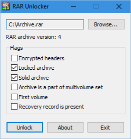

# RAR Unlocker

Removes the RAR archive lock attribute which protects the archive from modifications.

[🏠 Homepage](https://ramensoftware.com/rar-unlocker)

## Features

* View RAR archive attributes.
* Lock/unlock RAR archives.
* RAR 4.x and 5.0 format versions are supported.
* Can be used from the command line: \
  `rar_unlocker.exe archive.rar [--unlock | --lock]`
